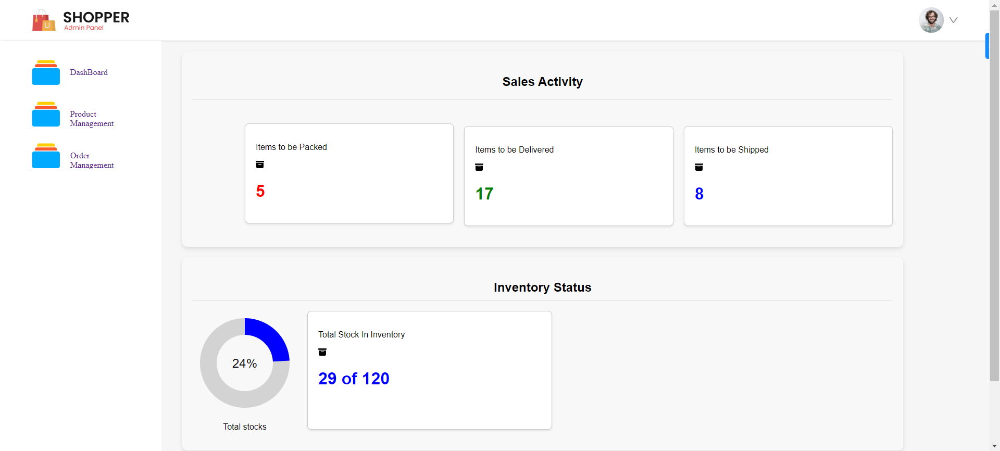
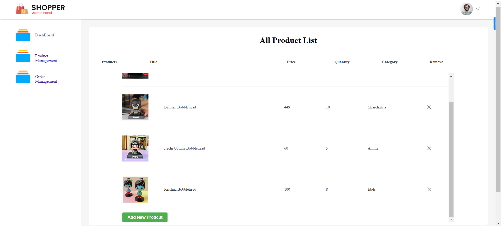
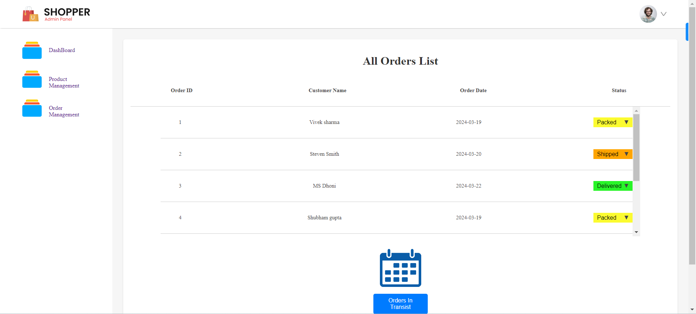
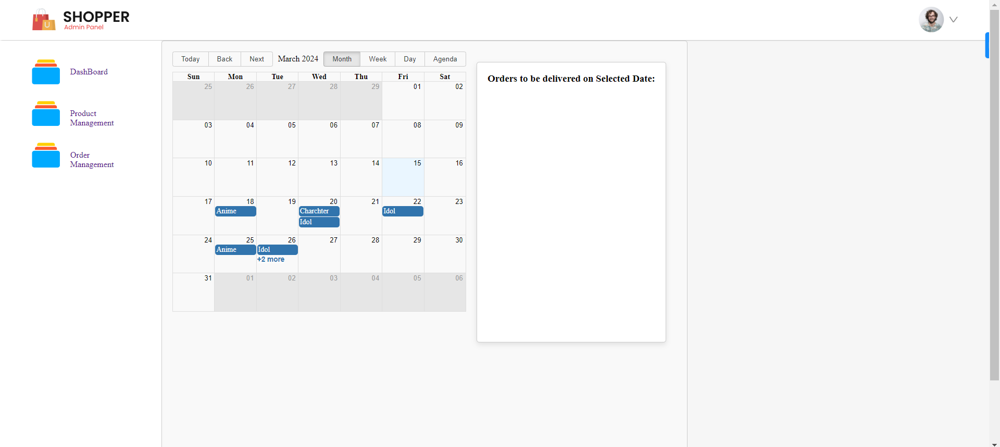

# ERP System with React

This project is a ERP (Enterprise Resource Planning) system interface built using React. It allows for the management of basic business operations efficiently.

## Features

- **Dashboard:** Provides an overview of key metrics and features of the ERP system. It dynamically updates based on changes in product listings. The dashboard also includes inventory tracking, where the text color changes and user get a alert as inventory reaches a below level.
- **Products Management:** Enables the management of product listings, including adding, editing, and deleting products. State management is handled using React Context.
- **Orders Management:** Facilitates viewing and handling of orders, including order details and status updates.
- **Calendar Feature:** Implemented within the Orders Management section, allowing users to track pending deliveries and view deliveries scheduled for a specific day. The calendar provides a visual representation of order delivery dates, enhancing planning and organization for efficient order management.

## Technologies Used

- React
- React Router
- React Context (for state management)
- HTML
- CSS

## Setup Instructions

1. Clone this repository to your local machine.
2. Navigate to the project directory.
3. Install dependencies using `npm install`.
4. Start the development server with `npm start`.

## Usage

- Upon starting the development server, navigate to `http://localhost:3000` in your web browser to access the application.
- Use the navigation links in the Sidebar to move between different sections of the ERP system.
- Manage products and orders as required. Changes in product listings will reflect dynamically in the dashboard.
- Utilize the calendar feature in the Orders Management section to track pending deliveries and view deliveries scheduled for a specific day.

## Screenshots

*Dashboard*

*Products Management*

*Orders Management*

*Orders Management*

## Submission

The project is hosted on GitHub. You can find it [here](https://github.com/kapilkapse7/ERP_SYSTEM).

The live version of the website is available [here](https://kapilkapse7.github.io/ERP_SYSTEM).
